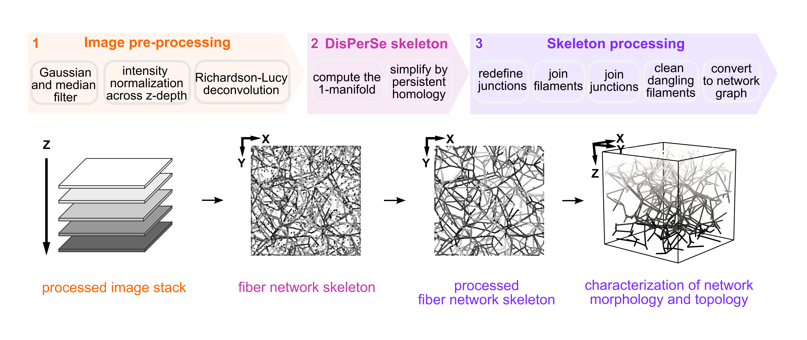

# ToFiE: Python framework for Fiber Topology Extraction from microscopy Images.

ToFiE is a semi-automated topology-aware fiber extraction workflow that facilitates connectivity-preserving 3D reconstructions of dense and heterogeneous collagen networks from confocal fluorescence images. ToFiE traces a skeleton based on Discrete Morse theory
(DMT) and persistent homology via DisPerse, making it more robust against noise and signal heterogeneity in experimental images. ToFiE is also generally applicable to biological fibrous networks for investigating structure-function and generating experimentally-informed microstructural templates for numerical studies. The workflows relies only on open-source algorithms and can be run completely within the Python environment. 

## Installation through terminal

First create a virtual environment with python 3.9.4.

`python3.9 -m venv ToFiE_env`

Then make sure to activate the environment in the terminal. 

`source ToFiE_env/bin/activate`

Install all python modules and dependencies needed using pip.

`pip install -r <project directory>/fiber_feature_analysis/requirements.txt`

Install ipykernel to run the workflow as in an interactive window on Visual Studio code.  

`python -m ipykernel install --name "ToFiE_env"`

## Workflow 
The workflow works in three steps: first it takes high resolution 3D images and performs image processing; denoising, correcting for intensity attenuation with depth, and deconvoluting using a theoretical PSF. Second, it links to the DisPerSe software (Sousbie 2011) to extract the 1-dimensional topological structure of the processed image data, in other words our fiber skeleton. Third, the filaments and junctions of the skeleton are further refined for the particular biological network of interest through several functions and converted into a graph network.

**Step 1. Image Pre-processing** -  **Input:** 3d image data (.tif file format). To address noise in the raw image, we apply a Gaussian filter, followed by a median filter. The contrast and intensities across the z-axis (depth) of the smoothened image are standardized by re-normalizing pixel intensities falling between a specified lower and upper threshold such that their values span the complete 8-bit range, based on the method of Intensify3D (Yayon et. al. 2018). Pixel values outside the thresholds are clipped to the 8-bit range limits. The normalizing step is important to ensure the algorithm reconstructs unbiasedly at all depths, as darker fibrous structures would be considered as less persistent topological features of the network. The enhanced image stack is deconvoluted with the Gaussian point spread function (PSF) and the Richardson-Lucy deconvolution algorithm using the SDeconv python framework (Prigent et. al. 2023). The resolution of the smoothened image, estimated with the Fourier Ring Correlation (FRC) function in the MIPLIB software (Koh et al. 2019), is used as the lateral and axial size of the PSF. To enhance the contrast after deconvolution, the image stack is renormalized to the full 8-bit range as previously.

**Step 2. Skeletonization** - Discrete Morse theory (DMT) and persistent homology form the mathematical framework for obtaining the initial skeleton of the collagen network from the processed image. For a detailed explanation, we refer the readers to the work of Sousbie.  We use the specific implementation of DMT in the DisPerSe software to trace the fiber skeleton through the discrete 1−manifold, taking a similar approach as Merle et. al. in DISSECT. Persistent homology identifies more persistent (robust) topological features. Persistence is defined as the difference in field intensities of a topological feature in the 1-manifold, a larger difference indicating greater topological importance. DisPerSe can be run either locally (given sufficient computing resources), or using the cluster. Four parameters (−cut, −smooth, −assemble, −trimBelow) enables adjusting the 1-manifold in DisPerSe. The cut parameter sets the persistence threshold: too high of a threshold means dim fibers are not traced, and too low of a threshold result in an overtraced network. The smooth parameter controls the number of sampling points to average over to smoothen a filament. The assemble parameter defines the maximum angle for merging neighboring filaments in the skeleton. The trimBelow parameter removes topological features associated with an intensity lower than the set threshold. Unwanted cross-connections between fibers across dark regions in the image are removed with a high enough threshold. The obtained DisPerSe skeleton S is defined in filament subunits F, where each filament is described by endpoints c and sampling points s.

**Step 3. Skeleton refinement** - 
A set of custom functions are applied for further refining filament subunits within the skeleton. Original filaments in the skeleton are first broken down at the branchpoints or endpoints, such that endpoints cannot be contained within the redefined filaments. This establishes a consistent base definition. Filaments shorter than a specific length threshold are merged with their neighboring filament, or removed, depending on the connectivity of the endpoints of the short filament. Neighboring filaments that share a similar orientation within an angle threshold are merged. To clean up the skeleton further, broken ends are removed, and to obtain a fully connected network dangling ends can also be removed. The processed skeleton is converted into an undirected graph with the NetworkX python library, with nodes and edges to represent the endpoints and filaments of the skeleton. **Output:** Reconstruction as a graph network (.pkl file format). 

### Example

The three steps can be run altogether with run.py or separately in run_steps.py. For larger image data that is computationally expensive to reconstruct locally, the skeletonization process is outsourced to Docker or Apptainer on a cluster. In that case specify in the function `ToFiE_workflow_step2(config_dir, config_file, local = False)`, instead of `ToFiE_workflow_step2(config_dir, config_file, local = True)`. 

